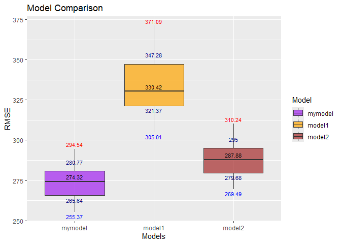

p8105_hw6_yy3564
================
Yonghao YU
2024-11-27

``` r
library(tidyverse)
```

    ## ── Attaching core tidyverse packages ──────────────────────── tidyverse 2.0.0 ──
    ## ✔ dplyr     1.1.4     ✔ readr     2.1.5
    ## ✔ forcats   1.0.0     ✔ stringr   1.5.1
    ## ✔ ggplot2   3.5.1     ✔ tibble    3.2.1
    ## ✔ lubridate 1.9.3     ✔ tidyr     1.3.1
    ## ✔ purrr     1.0.2     
    ## ── Conflicts ────────────────────────────────────────── tidyverse_conflicts() ──
    ## ✖ dplyr::filter() masks stats::filter()
    ## ✖ dplyr::lag()    masks stats::lag()
    ## ℹ Use the conflicted package (<http://conflicted.r-lib.org/>) to force all conflicts to become errors

``` r
library(ggcorrplot)
library(modelr)
library(mgcv)
```

    ## 载入需要的程序包：nlme
    ## 
    ## 载入程序包：'nlme'
    ## 
    ## The following object is masked from 'package:dplyr':
    ## 
    ##     collapse
    ## 
    ## This is mgcv 1.9-1. For overview type 'help("mgcv-package")'.

``` r
library(forcats)
```

# Problem 2

### First, import the data and do data preprocessing, Then create a city_state variable, and a binary variable indicating whether the homicide is solved

``` r
homicide = read_csv("data/homicide-data.csv") |>
  janitor::clean_names() |>
  mutate(city_state = str_c(city, state, sep = ", "),
         solved = ifelse(disposition == "Closed by arrest", 1, 0), 
         victim_age = as.numeric(victim_age)) |>
  filter(victim_race %in% c("White", "Black"))|>
  filter(!city_state %in% c("Dallas, TX", "Phoenix, AZ", "Kansas City, MO", "Tulsa, AL"))
```

    ## Rows: 52179 Columns: 12
    ## ── Column specification ────────────────────────────────────────────────────────
    ## Delimiter: ","
    ## chr (9): uid, victim_last, victim_first, victim_race, victim_age, victim_sex...
    ## dbl (3): reported_date, lat, lon
    ## 
    ## ℹ Use `spec()` to retrieve the full column specification for this data.
    ## ℹ Specify the column types or set `show_col_types = FALSE` to quiet this message.

    ## Warning: There was 1 warning in `mutate()`.
    ## ℹ In argument: `victim_age = as.numeric(victim_age)`.
    ## Caused by warning:
    ## ! 强制改变过程中产生了NA

``` r
homicide
```

    ## # A tibble: 39,693 × 14
    ##    uid        reported_date victim_last  victim_first victim_race victim_age
    ##    <chr>              <dbl> <chr>        <chr>        <chr>            <dbl>
    ##  1 Alb-000003      20100601 SATTERFIELD  VIVIANA      White               15
    ##  2 Alb-000005      20100102 MULA         VIVIAN       White               72
    ##  3 Alb-000006      20100126 BOOK         GERALDINE    White               91
    ##  4 Alb-000009      20100130 MARTIN-LEYVA GUSTAVO      White               56
    ##  5 Alb-000012      20100218 LUJAN        KEVIN        White               NA
    ##  6 Alb-000016      20100308 GRAY         STEFANIA     White               43
    ##  7 Alb-000018      20100323 DAVID        LARRY        White               52
    ##  8 Alb-000019      20100402 BRITO        ELIZABETH    White               22
    ##  9 Alb-000021      20100423 KING         TEVION       Black               15
    ## 10 Alb-000022      20100423 BOYKIN       CEDRIC       Black               25
    ## # ℹ 39,683 more rows
    ## # ℹ 8 more variables: victim_sex <chr>, city <chr>, state <chr>, lat <dbl>,
    ## #   lon <dbl>, disposition <chr>, city_state <chr>, solved <dbl>

### Then focus on Baltimore

``` r
baltimore = homicide |>
  filter(city_state == "Baltimore, MD") |>
  glm(solved ~ victim_age + victim_sex + victim_race, data = _, family = binomial)
result_display_baltimore = baltimore |>
  broom::tidy()
result_display_baltimore
```

    ## # A tibble: 4 × 5
    ##   term             estimate std.error statistic  p.value
    ##   <chr>               <dbl>     <dbl>     <dbl>    <dbl>
    ## 1 (Intercept)       0.310     0.171        1.81 7.04e- 2
    ## 2 victim_age       -0.00673   0.00332     -2.02 4.30e- 2
    ## 3 victim_sexMale   -0.854     0.138       -6.18 6.26e-10
    ## 4 victim_raceWhite  0.842     0.175        4.82 1.45e- 6

### Then we calculate and display the adjusted odds ratio and CI for Baltimore

``` r
adjusted_odds_ratio_CI <- baltimore |>
  broom::tidy(conf.int = TRUE) |>
  filter(term == "victim_sexMale") |>
  transmute(
    odds_ratio = exp(estimate),
    conf_low = exp(conf.low),
    conf_high = exp(conf.high)
  )
adjusted_odds_ratio_CI
```

    ## # A tibble: 1 × 3
    ##   odds_ratio conf_low conf_high
    ##        <dbl>    <dbl>     <dbl>
    ## 1      0.426    0.324     0.558

### Then for all cities, we calculate and display the adjusted odds ratio and CI

``` r
model_odds_ratio_ci = function(city_data){
  fit = glm(solved ~ victim_age + victim_sex + victim_race, data = city_data, family = binomial) |>
    broom::tidy(conf.int = TRUE, exponentiate = TRUE) |>
    filter(term == "victim_sexMale") |>
    select(odds_ratio = estimate, conf.low, conf.high)
}
cities = homicide |>
  group_by(city_state) |>
  nest() |>
  mutate(results = map(data, model_odds_ratio_ci)) |>
  unnest(results)
```

    ## Warning: There were 43 warnings in `mutate()`.
    ## The first warning was:
    ## ℹ In argument: `results = map(data, model_odds_ratio_ci)`.
    ## ℹ In group 1: `city_state = "Albuquerque, NM"`.
    ## Caused by warning:
    ## ! glm.fit:拟合概率算出来是数值零或一
    ## ℹ Run `dplyr::last_dplyr_warnings()` to see the 42 remaining warnings.

``` r
cities[,-2]
```

    ## # A tibble: 47 × 4
    ## # Groups:   city_state [47]
    ##    city_state      odds_ratio conf.low conf.high
    ##    <chr>                <dbl>    <dbl>     <dbl>
    ##  1 Albuquerque, NM      1.77     0.825     3.76 
    ##  2 Atlanta, GA          1.00     0.680     1.46 
    ##  3 Baltimore, MD        0.426    0.324     0.558
    ##  4 Baton Rouge, LA      0.381    0.204     0.684
    ##  5 Birmingham, AL       0.870    0.571     1.31 
    ##  6 Boston, MA           0.674    0.353     1.28 
    ##  7 Buffalo, NY          0.521    0.288     0.936
    ##  8 Charlotte, NC        0.884    0.551     1.39 
    ##  9 Chicago, IL          0.410    0.336     0.501
    ## 10 Cincinnati, OH       0.400    0.231     0.667
    ## # ℹ 37 more rows

``` r
ggplot(cities, aes(x = reorder(city_state, odds_ratio), y = odds_ratio)) +
  geom_point() +
  geom_errorbar(aes(ymin = conf.low, ymax = conf.high), width = 0.2) +
  labs(
    x = "City, State",
    y = "Estimated Odds Ratio (OR)",
    title = "Estimated Odds Ratios for all cities"
  ) +
  theme(axis.text.x = element_text(angle = 45, hjust = 1, size = 8))
```

<!-- -->

### Comment on the plot:

From the plot, we can observe that the cities with the highest odds
ratios for solving homicides like Minneapolis, MN, Stockton, CA, and
Fresno, CA show ORs above 1, indicating that homicides involving male
victims are more likely to be solved than those involving female
victims. However, the wide confidence intervals, with lower bounds
dipping below 1, highlight considerable statistical uncertainty. This
suggests that while male victims may have an advantage, the findings
lack precision and should be interpreted cautiously. Conversely, cities
like New York, NY, Baton Rouge, LA, and Omaha, NE have ORs closer to 0,
meaning male victim cases are less likely to be solved. These results
are statistically robust, with narrow confidence intervals remaining
below 1.

# Problem 3

### Load and clean the data for regression analysis (i.e. convert numeric to factor where appropriate, check for missing data, etc.)

### Then I calculate the total amount of NA values

``` r
birthweight = read_csv("data/birthweight.csv") |>
  janitor::clean_names() |>
  mutate(babysex = factor(babysex, labels = c("male", "female"))) |>
  mutate(frace = factor(frace, levels = c(1, 2, 3, 4, 8, 9), labels = c("white", "black", "asian", "puerto rican", "other", "unknown")))|>
  mutate(malform = factor(malform, labels = c("absent", "present")),mrace = factor(mrace, levels = c(1, 2, 3, 4, 8),labels = c("white", "black", "asian", "puerto rican", "other")))
```

    ## Rows: 4342 Columns: 20
    ## ── Column specification ────────────────────────────────────────────────────────
    ## Delimiter: ","
    ## dbl (20): babysex, bhead, blength, bwt, delwt, fincome, frace, gaweeks, malf...
    ## 
    ## ℹ Use `spec()` to retrieve the full column specification for this data.
    ## ℹ Specify the column types or set `show_col_types = FALSE` to quiet this message.

``` r
sum(is.na(birthweight))
```

    ## [1] 0

### Then I use all variables as predictor for the birth weight. After that, I use stepwise model selection to select some variables that best explain the variation in birth weight

``` r
full_model = lm(bwt ~ ., data = birthweight)
stepwise_model = MASS::stepAIC(full_model, direction = "both", trace = FALSE) |>
  broom::tidy()
stepwise_model
```

    ## # A tibble: 14 × 5
    ##    term               estimate std.error statistic   p.value
    ##    <chr>                 <dbl>     <dbl>     <dbl>     <dbl>
    ##  1 (Intercept)       -6099.      138.       -44.3  0        
    ##  2 babysexfemale        28.6       8.45       3.38 7.37e-  4
    ##  3 bhead               131.        3.45      37.9  3.10e-272
    ##  4 blength              74.9       2.02      37.1  4.29e-262
    ##  5 delwt                 4.11      0.392     10.5  2.26e- 25
    ##  6 fincome               0.318     0.175      1.82 6.88e-  2
    ##  7 gaweeks              11.6       1.46       7.93 2.79e- 15
    ##  8 mheight               6.59      1.78       3.69 2.23e-  4
    ##  9 mraceblack         -139.        9.91     -14.0  1.21e- 43
    ## 10 mraceasian          -74.9      42.3       -1.77 7.68e-  2
    ## 11 mracepuerto rican  -101.       19.3       -5.21 1.98e-  7
    ## 12 parity               96.3      40.3        2.39 1.70e-  2
    ## 13 ppwt                 -2.68      0.427     -6.26 4.20e- 10
    ## 14 smoken               -4.84      0.586     -8.27 1.75e- 16

### Then I check the multicollinearity among the predictors

``` r
meaningful_vars = birthweight[c("babysex", "bhead", "blength", "delwt", "fincome", "gaweeks", "mheight", "mrace", "parity", "ppwt", "smoken")]
meaningful_vars$babysex = as.numeric(meaningful_vars$babysex)
meaningful_vars$mrace = as.numeric(meaningful_vars$mrace)
correlation_matrix = cor(meaningful_vars)
ggcorrplot(correlation_matrix, hc.order = TRUE, type = "lower", lab = TRUE, colors = c("yellow", "white", "purple"))
```

<!-- -->

The plot revealed that ppwt was strongly correlated with delwt (r =
0.87), indicating high multicollinearity. So I remove ppwt variable.
Hence I include babysex, blength, bhead, delwt, fincome, gaweeks,
mheight, mrace, parity, and smoken as my predictors

### Plot of model residuals against fitted values

``` r
final_model = lm(bwt ~ babysex + blength + bhead +  delwt + fincome + gaweeks + mheight + mrace + parity + smoken, data = birthweight)
final_results = birthweight |> 
  modelr::add_residuals(final_model) |> 
  modelr::add_predictions(final_model)
final_plot = ggplot(final_results, aes(x = pred, y = resid)) +
  geom_point(alpha = 0.2, color = "blue") +
  labs( x = "Fitted Value", y = "Residual", title = "Final Regression Model Plot")
final_plot
```

<!-- -->

The plot shows that most residuals are around zero, suggesting that the
regression model is good in performance.

### Model comparison

``` r
set.seed(50)
comparison_plot_final = 
  crossv_mc(birthweight, 100) |>
  mutate(train = map(train, as_tibble), test = map(test, as_tibble)) |>
  mutate(
    mymodel = map(train, \(df) lm(bwt ~ babysex + blength + bhead + delwt + fincome + gaweeks + mheight + mrace + parity + smoken, data = birthweight)),
    model1 = map(train, \(df) lm(bwt ~ blength + gaweeks, data = birthweight)),
    model2 = map(train, \(df) lm(bwt ~ bhead * blength * babysex, data = birthweight))
  ) |>
  mutate(
    rmse_mymodel = map2_dbl(mymodel, test, \(mod, df) rmse(model = mod, data = df)),
    rmse_model1 = map2_dbl(model1, test, \(mod, df) rmse(model = mod, data = df)),
    rmse_model2 = map2_dbl(model2, test, \(mod, df) rmse(model = mod, data = df))
  ) |>
  select(starts_with("rmse")) |>
  pivot_longer(everything(), names_to = "model", values_to = "rmse",names_prefix = "rmse_") |> 
  mutate(model = fct_inorder(model))

boxplot_stats = comparison_plot_final |>
  group_by(model) |>
  summarize(min = min(rmse), q1 = quantile(rmse, 0.25), median = median(rmse), q3 = quantile(rmse, 0.75), max = max(rmse), .groups = "drop")

comparison_plot_final_plot = ggplot(comparison_plot_final, aes(x = model, y = rmse)) +
  geom_boxplot(aes(fill = model), alpha = 0.7) +  
  geom_text(
    data = boxplot_stats,
    aes(x = model, y = min, label = round(min, 2)), vjust = 1.5, size = 3, color = "blue") + 
  geom_text(
    data = boxplot_stats,
    aes(x = model, y = q1, label = round(q1, 2)), vjust = 1.5, size = 3, color = "navy") +  
  geom_text(
    data = boxplot_stats,
    aes(x = model, y = median, label = round(median, 2)), vjust = -0.5, size = 3, color = "black") +  
  geom_text(
    data = boxplot_stats,
    aes(x = model, y = q3, label = round(q3, 2)), vjust = -1.5, size = 3, color = "navy") +  
  geom_text(
    data = boxplot_stats,
    aes(x = model, y = max, label = round(max, 2)), vjust = -0.5, size = 3, color = "red") +  
  labs(x = "Models", y = "RMSE", title = "Model Comparison", fill = "Model") + 
  scale_fill_manual(values = c("mymodel" = "purple", "model1" = "orange", "model2" = "brown"))
  theme_minimal() 
```

    ## List of 136
    ##  $ line                            :List of 6
    ##   ..$ colour       : chr "black"
    ##   ..$ linewidth    : num 0.5
    ##   ..$ linetype     : num 1
    ##   ..$ lineend      : chr "butt"
    ##   ..$ arrow        : logi FALSE
    ##   ..$ inherit.blank: logi TRUE
    ##   ..- attr(*, "class")= chr [1:2] "element_line" "element"
    ##  $ rect                            :List of 5
    ##   ..$ fill         : chr "white"
    ##   ..$ colour       : chr "black"
    ##   ..$ linewidth    : num 0.5
    ##   ..$ linetype     : num 1
    ##   ..$ inherit.blank: logi TRUE
    ##   ..- attr(*, "class")= chr [1:2] "element_rect" "element"
    ##  $ text                            :List of 11
    ##   ..$ family       : chr ""
    ##   ..$ face         : chr "plain"
    ##   ..$ colour       : chr "black"
    ##   ..$ size         : num 11
    ##   ..$ hjust        : num 0.5
    ##   ..$ vjust        : num 0.5
    ##   ..$ angle        : num 0
    ##   ..$ lineheight   : num 0.9
    ##   ..$ margin       : 'margin' num [1:4] 0points 0points 0points 0points
    ##   .. ..- attr(*, "unit")= int 8
    ##   ..$ debug        : logi FALSE
    ##   ..$ inherit.blank: logi TRUE
    ##   ..- attr(*, "class")= chr [1:2] "element_text" "element"
    ##  $ title                           : NULL
    ##  $ aspect.ratio                    : NULL
    ##  $ axis.title                      : NULL
    ##  $ axis.title.x                    :List of 11
    ##   ..$ family       : NULL
    ##   ..$ face         : NULL
    ##   ..$ colour       : NULL
    ##   ..$ size         : NULL
    ##   ..$ hjust        : NULL
    ##   ..$ vjust        : num 1
    ##   ..$ angle        : NULL
    ##   ..$ lineheight   : NULL
    ##   ..$ margin       : 'margin' num [1:4] 2.75points 0points 0points 0points
    ##   .. ..- attr(*, "unit")= int 8
    ##   ..$ debug        : NULL
    ##   ..$ inherit.blank: logi TRUE
    ##   ..- attr(*, "class")= chr [1:2] "element_text" "element"
    ##  $ axis.title.x.top                :List of 11
    ##   ..$ family       : NULL
    ##   ..$ face         : NULL
    ##   ..$ colour       : NULL
    ##   ..$ size         : NULL
    ##   ..$ hjust        : NULL
    ##   ..$ vjust        : num 0
    ##   ..$ angle        : NULL
    ##   ..$ lineheight   : NULL
    ##   ..$ margin       : 'margin' num [1:4] 0points 0points 2.75points 0points
    ##   .. ..- attr(*, "unit")= int 8
    ##   ..$ debug        : NULL
    ##   ..$ inherit.blank: logi TRUE
    ##   ..- attr(*, "class")= chr [1:2] "element_text" "element"
    ##  $ axis.title.x.bottom             : NULL
    ##  $ axis.title.y                    :List of 11
    ##   ..$ family       : NULL
    ##   ..$ face         : NULL
    ##   ..$ colour       : NULL
    ##   ..$ size         : NULL
    ##   ..$ hjust        : NULL
    ##   ..$ vjust        : num 1
    ##   ..$ angle        : num 90
    ##   ..$ lineheight   : NULL
    ##   ..$ margin       : 'margin' num [1:4] 0points 2.75points 0points 0points
    ##   .. ..- attr(*, "unit")= int 8
    ##   ..$ debug        : NULL
    ##   ..$ inherit.blank: logi TRUE
    ##   ..- attr(*, "class")= chr [1:2] "element_text" "element"
    ##  $ axis.title.y.left               : NULL
    ##  $ axis.title.y.right              :List of 11
    ##   ..$ family       : NULL
    ##   ..$ face         : NULL
    ##   ..$ colour       : NULL
    ##   ..$ size         : NULL
    ##   ..$ hjust        : NULL
    ##   ..$ vjust        : num 1
    ##   ..$ angle        : num -90
    ##   ..$ lineheight   : NULL
    ##   ..$ margin       : 'margin' num [1:4] 0points 0points 0points 2.75points
    ##   .. ..- attr(*, "unit")= int 8
    ##   ..$ debug        : NULL
    ##   ..$ inherit.blank: logi TRUE
    ##   ..- attr(*, "class")= chr [1:2] "element_text" "element"
    ##  $ axis.text                       :List of 11
    ##   ..$ family       : NULL
    ##   ..$ face         : NULL
    ##   ..$ colour       : chr "grey30"
    ##   ..$ size         : 'rel' num 0.8
    ##   ..$ hjust        : NULL
    ##   ..$ vjust        : NULL
    ##   ..$ angle        : NULL
    ##   ..$ lineheight   : NULL
    ##   ..$ margin       : NULL
    ##   ..$ debug        : NULL
    ##   ..$ inherit.blank: logi TRUE
    ##   ..- attr(*, "class")= chr [1:2] "element_text" "element"
    ##  $ axis.text.x                     :List of 11
    ##   ..$ family       : NULL
    ##   ..$ face         : NULL
    ##   ..$ colour       : NULL
    ##   ..$ size         : NULL
    ##   ..$ hjust        : NULL
    ##   ..$ vjust        : num 1
    ##   ..$ angle        : NULL
    ##   ..$ lineheight   : NULL
    ##   ..$ margin       : 'margin' num [1:4] 2.2points 0points 0points 0points
    ##   .. ..- attr(*, "unit")= int 8
    ##   ..$ debug        : NULL
    ##   ..$ inherit.blank: logi TRUE
    ##   ..- attr(*, "class")= chr [1:2] "element_text" "element"
    ##  $ axis.text.x.top                 :List of 11
    ##   ..$ family       : NULL
    ##   ..$ face         : NULL
    ##   ..$ colour       : NULL
    ##   ..$ size         : NULL
    ##   ..$ hjust        : NULL
    ##   ..$ vjust        : num 0
    ##   ..$ angle        : NULL
    ##   ..$ lineheight   : NULL
    ##   ..$ margin       : 'margin' num [1:4] 0points 0points 2.2points 0points
    ##   .. ..- attr(*, "unit")= int 8
    ##   ..$ debug        : NULL
    ##   ..$ inherit.blank: logi TRUE
    ##   ..- attr(*, "class")= chr [1:2] "element_text" "element"
    ##  $ axis.text.x.bottom              : NULL
    ##  $ axis.text.y                     :List of 11
    ##   ..$ family       : NULL
    ##   ..$ face         : NULL
    ##   ..$ colour       : NULL
    ##   ..$ size         : NULL
    ##   ..$ hjust        : num 1
    ##   ..$ vjust        : NULL
    ##   ..$ angle        : NULL
    ##   ..$ lineheight   : NULL
    ##   ..$ margin       : 'margin' num [1:4] 0points 2.2points 0points 0points
    ##   .. ..- attr(*, "unit")= int 8
    ##   ..$ debug        : NULL
    ##   ..$ inherit.blank: logi TRUE
    ##   ..- attr(*, "class")= chr [1:2] "element_text" "element"
    ##  $ axis.text.y.left                : NULL
    ##  $ axis.text.y.right               :List of 11
    ##   ..$ family       : NULL
    ##   ..$ face         : NULL
    ##   ..$ colour       : NULL
    ##   ..$ size         : NULL
    ##   ..$ hjust        : num 0
    ##   ..$ vjust        : NULL
    ##   ..$ angle        : NULL
    ##   ..$ lineheight   : NULL
    ##   ..$ margin       : 'margin' num [1:4] 0points 0points 0points 2.2points
    ##   .. ..- attr(*, "unit")= int 8
    ##   ..$ debug        : NULL
    ##   ..$ inherit.blank: logi TRUE
    ##   ..- attr(*, "class")= chr [1:2] "element_text" "element"
    ##  $ axis.text.theta                 : NULL
    ##  $ axis.text.r                     :List of 11
    ##   ..$ family       : NULL
    ##   ..$ face         : NULL
    ##   ..$ colour       : NULL
    ##   ..$ size         : NULL
    ##   ..$ hjust        : num 0.5
    ##   ..$ vjust        : NULL
    ##   ..$ angle        : NULL
    ##   ..$ lineheight   : NULL
    ##   ..$ margin       : 'margin' num [1:4] 0points 2.2points 0points 2.2points
    ##   .. ..- attr(*, "unit")= int 8
    ##   ..$ debug        : NULL
    ##   ..$ inherit.blank: logi TRUE
    ##   ..- attr(*, "class")= chr [1:2] "element_text" "element"
    ##  $ axis.ticks                      : list()
    ##   ..- attr(*, "class")= chr [1:2] "element_blank" "element"
    ##  $ axis.ticks.x                    : NULL
    ##  $ axis.ticks.x.top                : NULL
    ##  $ axis.ticks.x.bottom             : NULL
    ##  $ axis.ticks.y                    : NULL
    ##  $ axis.ticks.y.left               : NULL
    ##  $ axis.ticks.y.right              : NULL
    ##  $ axis.ticks.theta                : NULL
    ##  $ axis.ticks.r                    : NULL
    ##  $ axis.minor.ticks.x.top          : NULL
    ##  $ axis.minor.ticks.x.bottom       : NULL
    ##  $ axis.minor.ticks.y.left         : NULL
    ##  $ axis.minor.ticks.y.right        : NULL
    ##  $ axis.minor.ticks.theta          : NULL
    ##  $ axis.minor.ticks.r              : NULL
    ##  $ axis.ticks.length               : 'simpleUnit' num 2.75points
    ##   ..- attr(*, "unit")= int 8
    ##  $ axis.ticks.length.x             : NULL
    ##  $ axis.ticks.length.x.top         : NULL
    ##  $ axis.ticks.length.x.bottom      : NULL
    ##  $ axis.ticks.length.y             : NULL
    ##  $ axis.ticks.length.y.left        : NULL
    ##  $ axis.ticks.length.y.right       : NULL
    ##  $ axis.ticks.length.theta         : NULL
    ##  $ axis.ticks.length.r             : NULL
    ##  $ axis.minor.ticks.length         : 'rel' num 0.75
    ##  $ axis.minor.ticks.length.x       : NULL
    ##  $ axis.minor.ticks.length.x.top   : NULL
    ##  $ axis.minor.ticks.length.x.bottom: NULL
    ##  $ axis.minor.ticks.length.y       : NULL
    ##  $ axis.minor.ticks.length.y.left  : NULL
    ##  $ axis.minor.ticks.length.y.right : NULL
    ##  $ axis.minor.ticks.length.theta   : NULL
    ##  $ axis.minor.ticks.length.r       : NULL
    ##  $ axis.line                       : list()
    ##   ..- attr(*, "class")= chr [1:2] "element_blank" "element"
    ##  $ axis.line.x                     : NULL
    ##  $ axis.line.x.top                 : NULL
    ##  $ axis.line.x.bottom              : NULL
    ##  $ axis.line.y                     : NULL
    ##  $ axis.line.y.left                : NULL
    ##  $ axis.line.y.right               : NULL
    ##  $ axis.line.theta                 : NULL
    ##  $ axis.line.r                     : NULL
    ##  $ legend.background               : list()
    ##   ..- attr(*, "class")= chr [1:2] "element_blank" "element"
    ##  $ legend.margin                   : 'margin' num [1:4] 5.5points 5.5points 5.5points 5.5points
    ##   ..- attr(*, "unit")= int 8
    ##  $ legend.spacing                  : 'simpleUnit' num 11points
    ##   ..- attr(*, "unit")= int 8
    ##  $ legend.spacing.x                : NULL
    ##  $ legend.spacing.y                : NULL
    ##  $ legend.key                      : list()
    ##   ..- attr(*, "class")= chr [1:2] "element_blank" "element"
    ##  $ legend.key.size                 : 'simpleUnit' num 1.2lines
    ##   ..- attr(*, "unit")= int 3
    ##  $ legend.key.height               : NULL
    ##  $ legend.key.width                : NULL
    ##  $ legend.key.spacing              : 'simpleUnit' num 5.5points
    ##   ..- attr(*, "unit")= int 8
    ##  $ legend.key.spacing.x            : NULL
    ##  $ legend.key.spacing.y            : NULL
    ##  $ legend.frame                    : NULL
    ##  $ legend.ticks                    : NULL
    ##  $ legend.ticks.length             : 'rel' num 0.2
    ##  $ legend.axis.line                : NULL
    ##  $ legend.text                     :List of 11
    ##   ..$ family       : NULL
    ##   ..$ face         : NULL
    ##   ..$ colour       : NULL
    ##   ..$ size         : 'rel' num 0.8
    ##   ..$ hjust        : NULL
    ##   ..$ vjust        : NULL
    ##   ..$ angle        : NULL
    ##   ..$ lineheight   : NULL
    ##   ..$ margin       : NULL
    ##   ..$ debug        : NULL
    ##   ..$ inherit.blank: logi TRUE
    ##   ..- attr(*, "class")= chr [1:2] "element_text" "element"
    ##  $ legend.text.position            : NULL
    ##  $ legend.title                    :List of 11
    ##   ..$ family       : NULL
    ##   ..$ face         : NULL
    ##   ..$ colour       : NULL
    ##   ..$ size         : NULL
    ##   ..$ hjust        : num 0
    ##   ..$ vjust        : NULL
    ##   ..$ angle        : NULL
    ##   ..$ lineheight   : NULL
    ##   ..$ margin       : NULL
    ##   ..$ debug        : NULL
    ##   ..$ inherit.blank: logi TRUE
    ##   ..- attr(*, "class")= chr [1:2] "element_text" "element"
    ##  $ legend.title.position           : NULL
    ##  $ legend.position                 : chr "right"
    ##  $ legend.position.inside          : NULL
    ##  $ legend.direction                : NULL
    ##  $ legend.byrow                    : NULL
    ##  $ legend.justification            : chr "center"
    ##  $ legend.justification.top        : NULL
    ##  $ legend.justification.bottom     : NULL
    ##  $ legend.justification.left       : NULL
    ##  $ legend.justification.right      : NULL
    ##  $ legend.justification.inside     : NULL
    ##  $ legend.location                 : NULL
    ##  $ legend.box                      : NULL
    ##  $ legend.box.just                 : NULL
    ##  $ legend.box.margin               : 'margin' num [1:4] 0cm 0cm 0cm 0cm
    ##   ..- attr(*, "unit")= int 1
    ##  $ legend.box.background           : list()
    ##   ..- attr(*, "class")= chr [1:2] "element_blank" "element"
    ##  $ legend.box.spacing              : 'simpleUnit' num 11points
    ##   ..- attr(*, "unit")= int 8
    ##   [list output truncated]
    ##  - attr(*, "class")= chr [1:2] "theme" "gg"
    ##  - attr(*, "complete")= logi TRUE
    ##  - attr(*, "validate")= logi TRUE

``` r
comparison_plot_final_plot
```

<!-- -->

The boxplot shows that my model has the lowest RMSE. This indicates that
my model is the best model among the three models provided for
predicting children’s birthweight.
